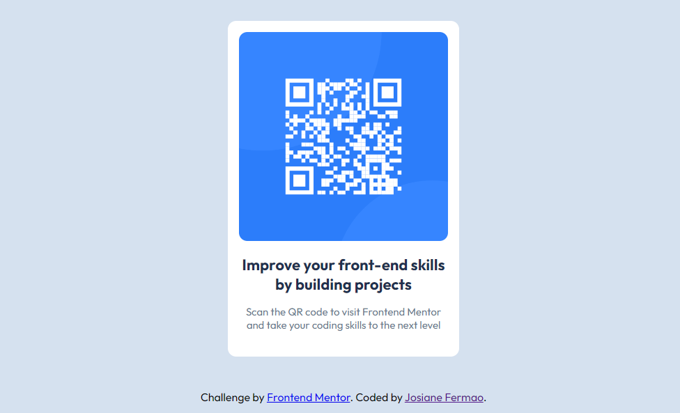

# Frontend Mentor - QR code component solution

This is a solution to the [QR code component challenge on Frontend Mentor](https://www.frontendmentor.io/challenges/qr-code-component-iux_sIO_H). Frontend Mentor challenges help you improve your coding skills by building realistic projects. 

### Screenshot

### Links

- Solution URL: [My solution](https://www.frontendmentor.io/solutions/qr-code-component-solution-a0CMtWrwtp)
- Live Site URL: [My Qrcode Project](https://qr-code-desing.vercel.app/)

### Built with

- Semantic HTML5 markup
- CSS custom properties
- Flexbox
- Mobile-first workflow

## Author

- Frontend Mentor - [@josifermaodev](https://www.frontendmentor.io/profile/josifermaodev)

